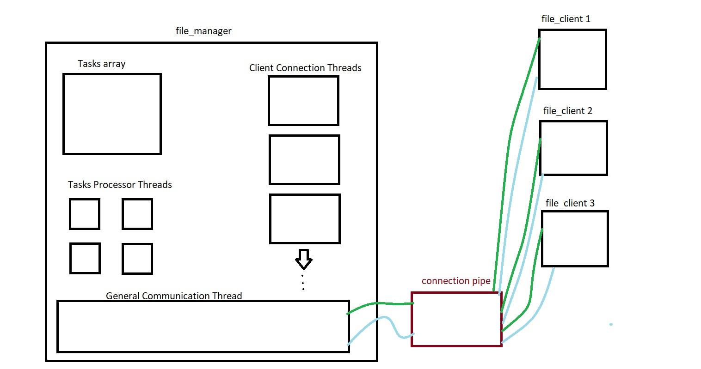
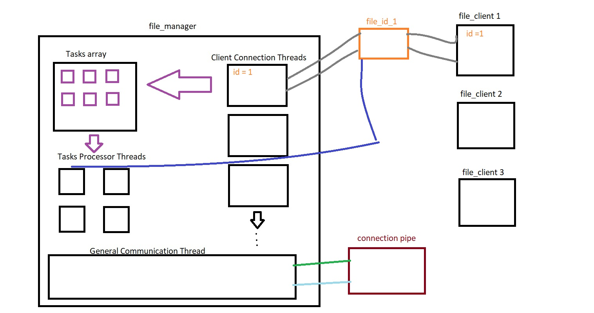

# Multithread-File-Management

In this project, a file management program was developed on the Linux operating system using the C programming language. The file management program includes various commands, responses returned by these commands, and error messages. The file management program was structured using <b>named pipes</b>, <b>synchronization</b>, and <b> multithreading processes</b> in C language.

The system was generally designed to consist of three different sets of threads on the server side and a set of clients. Accordingly, 

- Tasks processor threads that will process commands with the information belonging to the task structure in the tasks array
- General communication thread that will allow the client to receive an ID
- Client connection threads that will listen as long as the clients are connected.

The client, after receiving an ID, was programmed to open a custom named pipe with the server for its own use and for the connected thread. This channel enabled the implementation of send and receive operations between the server and client. The client connection was programmed to convert the received command into a task structure and send the desired command to the task array for processing.

Multiple threads were created under the task processor thread category and they continued to operate until there were no more tasks in the task array to perform. Lock operations were implemented where necessary to ensure synchronization, and feedback was provided to the client thread via the named pipe after sending messages to the client through a client-specific message variable.

Once the system was set up, file operations such as creating, deleting, writing, and reading files were performed in response to commands. Lock operations were also applied where needed to ensure synchronization and file lists were adjusted accordingly. The thread lists were organized appropriately as well.

